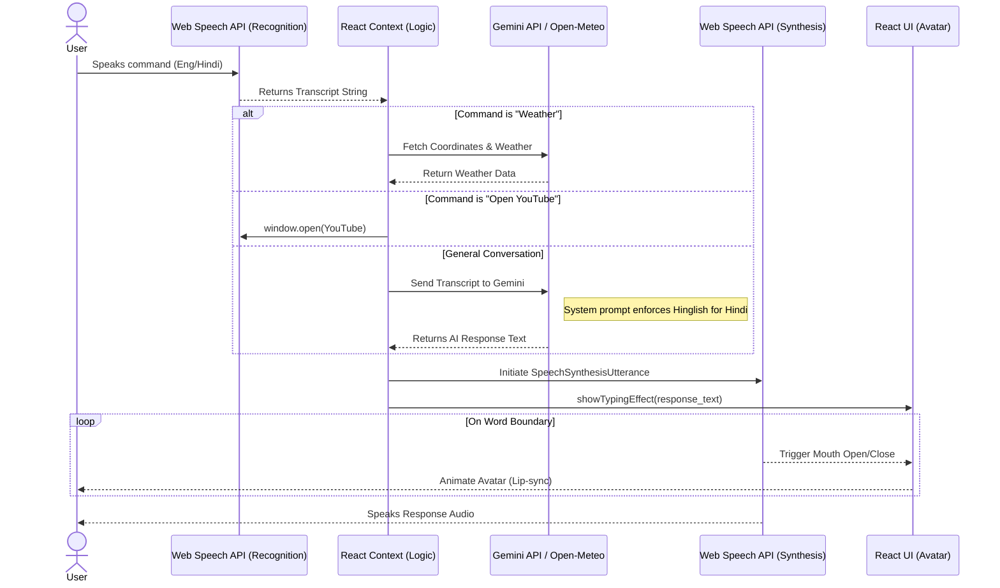

# 🎙️ Astra - Advanced Virtual Voice Assistant

[](https://aastraa.netlify.app/)
[]()
[]()

Astra is an intelligent, bilingual virtual voice assistant built with React and powered by Google's Gemini AI. It seamlessly understands and speaks both English and Hindi, executes hardcoded utility commands (like fetching weather or opening websites), and features an interactive UI with dynamic lip-syncing.

---

## ✨ Features

- 🗣️ **Bilingual Support:** Understands and speaks both English and Hindi seamlessly using Romanized text for perfect Indian male voice synthesis.
- 🤖 **Gemini AI Integration:** Employs the `gemini-2.5-flash` model with persistent conversational memory for smart, contextual responses.
- 🎤 **Voice Interaction:** Uses the Web Speech API (`SpeechRecognition`) to listen to user input and (`SpeechSynthesis`) to speak responses naturally.
- 🌤️ **Live Utilities:** Automatically fetches real-time weather using the Open-Meteo API & Geolocation, checks the date/time, and opens popular sites (YouTube, Google, LinkedIn).
- 👄 **Dynamic Lip Sync:** The avatar visually responds to speech boundaries, creating an interactive visual experience.

---

## 🏗️ Architecture & Interaction Flow

The following sequence diagram outlines how Astra processes a voice command, interacts with the Gemini API or utility functions, and returns a spoken response.



---

## 🛠️ Tech Stack

- **Frontend:** React.js, Context API, Vanilla CSS
- **AI Model:** Google Gemini API (`@google/generative-ai`)
- **Speech APIs:** Web Speech API (`window.SpeechRecognition` & `window.speechSynthesis`)
- **External Data:** Open-Meteo API (Weather data)

---

## 🚀 Local Development Setup

To run Astra locally on your machine, follow these steps:

### 1. Clone the repository
```bash
git clone https://github.com/ushantsingh/Astra.git
cd Astra
```

### 2. Install Dependencies
```bash
npm install
```

### 3. Setup Environment Variables
Create a `.env` file in the root of the project and add your Google Gemini API key:
```env
VITE_GEMINI_API_KEY="your_api_key_here"
```

### 4. Start the Development Server
```bash
npm run dev
```
Open `http://localhost:5173` in your browser. Ensure you grant microphone and location permissions when prompted!
